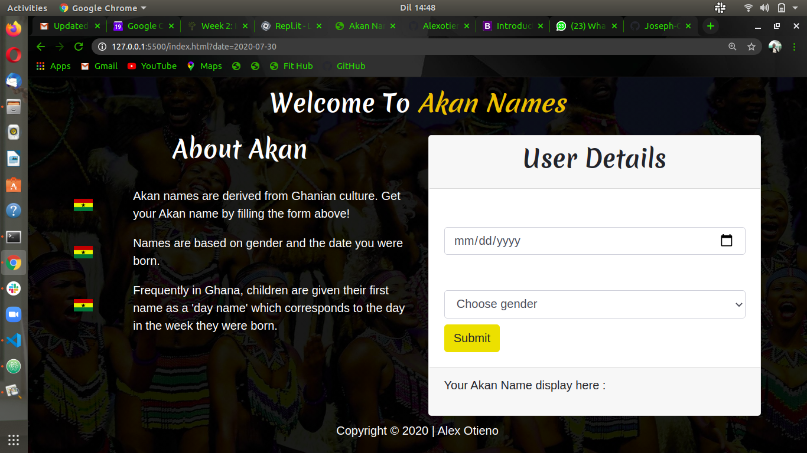

### Akan Name Generator

#### Author
* Alex Otieno

#### Description

This project is a web application that takes a user's birthday and calculates the day of the week they were born and then depending on their gender outputs their Akan Name is displayed

#### Screenshot

#### Live Demo

#### Installation / Set up instruction
* git clone https://github.com/Alexotieno1717/Akan-names.git
* cd Akan-names
* code . [ Open In text editor]

#### Technologies Used
* HTML 5
* CSS 3
* Markdown
* Bootstrap 4
* Javascript

#### BDD

##### Input
Enter date of birth eg 22/11/2020, -Input Example 22/11/2020 the out put 22/11/2010.

Enter the Gender eg Male.

Submit. Input example, the program compares the inputs with the conditions set for the inputs eg if No input field is empty, the program executes else an alert to enter valid deatils

##### Output
True value is output. Output example: You were born on Sunday and Your Akan name is Yaw!. If your gender is Male for the year 2010.

#### Known Bugs
* Some output are not as accurate as expected.

#### Contact Information
If you have question or you want to contribute please contact me at alexotieno900@gmail.com

